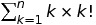
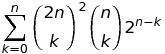

Suppose your career depends on solving equations like

or more intimidating ones as

and your magic tricks toolbox fail to handle it.
What is the last resort?

Synopsis
========

Maxima package to solve hypergeometric sums.

Description
===========

`hipergeo' is a hypergeometric package for the computer algebra system Maxima featuring:
- Sister Celine implementation;
- friendly link to Gosper implementation from `zeilberger' package;
- Builds full recurrence from Zeilberger's algorithm;
- WZ and WZ certificate implementation.

Please, refer to "A=B" (Petkovsek, Wilf, Zeilberger) book for algorithms.

Moreover, you can refer to `documentation-pt\_BR.pdf' for portuguese
documentation. Here, you have practical introduction to hypergeometric
summation 100% Maxima-oriented with some level of deepness on the algorithms
throughout the text.

Load the library
================

In Maxima, type

> load('hipergeo.mac');

in order to load the package.

To-do
=====

- Fix WZ.
